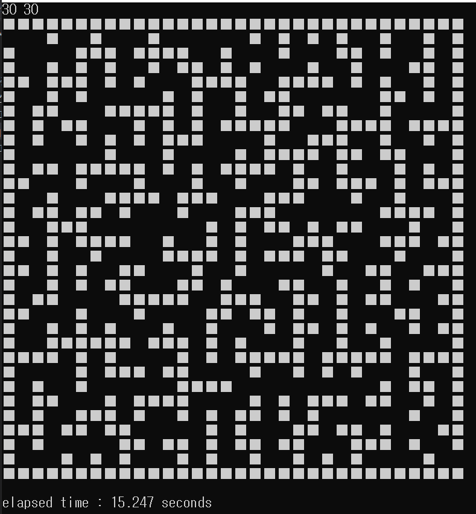

# MaMa

## Make Maze (미로 만드는 라이브러리)

갑자기 삘받아서 충동적으로 C++로 만들어봤습니다.

Python만 쓰다가 C++ 쓰려니 손이 떨리는군요.

순수 standard 라이브러리만 사용했습니다..

## Implementation
```
MaMa.cpp
```

## Demo


## Problem

1. 너무 오래걸린다. 시간복잡도를 계산해보자면(가로 길이 : W, 세로 길이 : H)
  - 돌 만드는 횟수(K) : O(K)
  - flood_fill : O(WH)
  - check_hole : O(WH)
  - check_lump : O(1)
  - check_edge : O(1)

  ☞ 총합 : O(WHK)

2. 너무 뚫려있다. (뭔말인지 알죠?)
